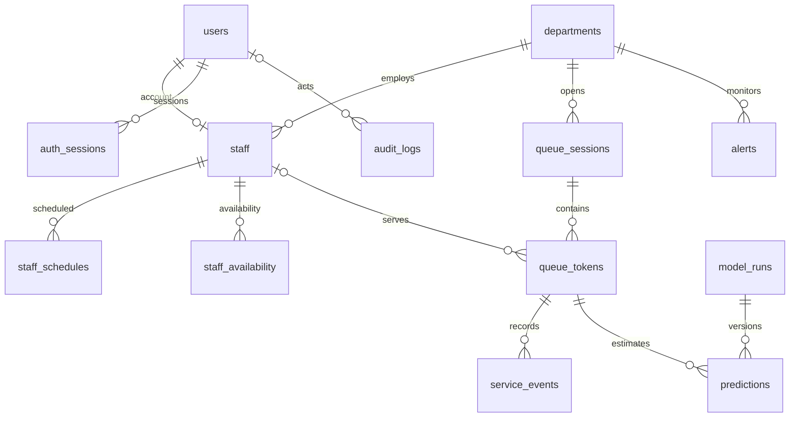

# Database architecture

PostgreSQL is the planned operational source of truth. Composite references prevent assigning a token or event to a different department's staff. Foreign keys restrict deleting referenced entities; there is no blanket cascading data deletion. Queue and event timestamps are validated by checks and triggers. Partial indexes support waiting tokens, completions and unresolved alerts; other indexes support department/date filters and latest staff/prediction lookups.

The Next.js dataset review reads the generated summary JSON at build time. This is explicitly a snapshot, not database health or live operations. Rebuild the frontend after regenerating a different snapshot.

Migrations run under one PostgreSQL transaction and advisory lock, with filename/checksum tracking. The seeder takes the same lock, refuses existing department data, and loads the entire SQL seed transactionally. Runtime application credentials/permissions will be introduced with authentication; the Docker database-owner credential is for local provisioning only.

Product migration 005 adds private token lookup keys, historical-import deduplication keys and partial unique indexes for one active token per clinician and one unresolved alert per department/type. Login attempt counters and opaque session hashes are persisted in PostgreSQL. API runtime now has explicitly scoped product grants in `database/sql/product_runtime_grants.sql`; schema creation, owner privileges and user deletion remain forbidden.
