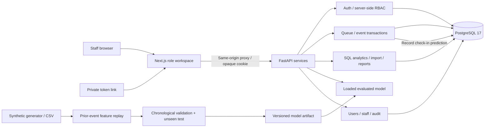

# QueueSense system architecture

The database is the source of truth for active queue events, sessions, users, staff, availability, predictions and audit records. The static `/demo-data` page remains a clearly labelled historical snapshot. Operational pages poll every five seconds; requests query database snapshots. Auth/session responses and service proxy requests use no-store.

All mutations require an allowlisted Origin and server-side role checks. Token transitions and associated events are committed atomically. A PostgreSQL advisory lock serializes queue numbering/state changes and a partial unique index prevents one clinician holding two called/in-service tokens. Doctor accounts can operate only on their linked clinician. Manager accounts are read-only for queues and can access analytics/planning/import/export; administrator accounts configure the clinic.

Models train outside request handling. Selection uses chronological validation; only the selected model is evaluated after a train+validation refit against untouched test dates. The API records model version and predicted wait at check-in when staffing is available. It monitors observed errors after service begins.

The deterministic simulator calculates service capacity, queue wait and net queue clearance. If arrivals meet/exceed capacity, it returns no finite clearance time. Alerts compare queue thresholds, arrivals vs capacity, recent delay against history and observed model error. Managers trigger evaluation explicitly; refresh is not advertised as a background scheduling service.
